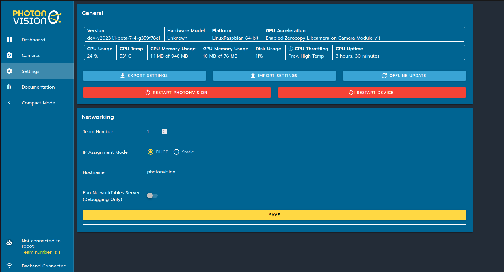

# Settings

## General

Here, you can view general data on your system, including version, hardware, your platform, and performance statistics. You can also export/import the settings in a .zip file or restart PhotonVision/your coprocessor.

## Networking

Here, you can set your team number, switch your IP between DHCP and static, and specify your host name. For more information about on-robot networking, click [here.](https://docs.wpilib.org/en/latest/docs/networking/networking-introduction/networking-basics.html)

The "team number" field will accept (in addition to a team number) an IP address or hostname. This is useful for testing PhotonVision on the same computer as a simulated robot program;
you can set the team number to "localhost", and PhotonVision will send data to the network tables in the simulated robot.

:::note
Something must be entered into the team number field if using PhotonVision on a robot. Using a team number is recommended (as opposed to an IP address or hostname).
:::

## LEDs

If your coprocessor electronics support hardware-controlled LED's and has the proper hardware configuration set up, here you can adjust the brightness of your LEDs.
